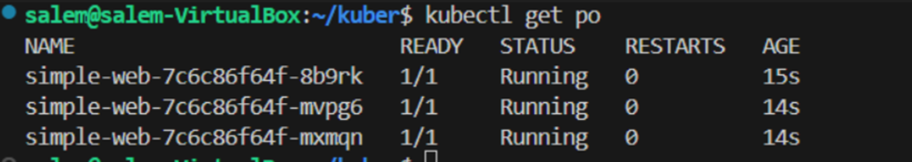

Q1: Create Pod `nginx` with name `my-nginx` directly from command (no YAML file)  

- Explanation:
We use `kubectl run` to create a pod directly without writing YAML.  

- Command used: 
kubectl run my-nginx --image=nginx

-Output of the command:
pod/my-nginx created

- Screenshot:

---------------------------------------
Q2: Create Pod `nginx` with name `my-nginx` and image `nginx123` (invalid image) directly from command  

- Explanation: 
we  use a wrong image (`nginx123`) to test failure cases.  

- Command used:
kubectl run my-nginx --image=nginx123

- Output of the command:
pod/my-nginx created

- Screenshot:

---------------------------------------
Q3: Check the status and why it doesn’t work  

- Explanation:
We describe the pod to see detailed error logs about why the image didn’t pull.  

- Command used:
kubectl describe pod my-nginx

- Reason:
 Image `nginx123` doesn’t exist in Docker Hub.  

- Screenshot:

---------------------------------------
Q4: Get Node Name, Pod IP, and Image of the Pod  

- Command used: 
kubectl get pod my-nginx -o wide

- Screenshot:

---------------------------------------
Q5: Delete the Pod  

- Command used:
kubectl delete pod my-nginx

- Screenshot:

---------------------------------------
Q6: Create Pod with YAML file and use label

- Explanation:  
We create a Pod definition in a YAML file (`pod.yaml`) with a label `app=my-nginx`.

- YAML File:
[text](yamls/pod.yml)

- Command used:
kubectl apply -f yamls/pod.yml

- Output of the command:
pod/nginx created

- Screenshot:

-------------------------------------
Q7: Create ReplicaSet with 3 replicas using nginx Image

- Explanation:
ReplicaSet ensures the desired number of Pods (3 in this case) are always running.

- YAML File:
[text](yamls/rs.yml)

- Command used:
kubectl apply -f yamls/rs.yml

- Output of the command:
replicaset.apps/nginx-re created

- Screenshot:

--------------------------------------
Q8: Scale the ReplicaSet to 5 (without editing YAML file)

- Explanation:
We use the kubectl scale command instead of editing the YAML.

- Command used:
kubectl scale rs nginx-re --replicas=5

- Output of the command:
replicaset.apps/nginx-re scaled

- Screenshot:

------------------------------------
Q9: Delete one of the 5 Pods and check what happens

- Explanation:
If we delete one Pod, ReplicaSet detects fewer Pods than desired (5), so it automatically creates a new Pod to maintain the count.

- Command used:
kubectl delete po nginx-re-2mrj7

- Output of the command:
pod "nginx-re-2mrj7" deleted from default namespace

- Screenshot:

------------------------------------
Q10: Scale down the ReplicaSet to 2 without using scale command

Explanation:
We patch the ReplicaSet directly from terminal instead of using kubectl scale.

- Command used:
kubectl scale rs nginx-re --replicas=2

- Output of the command:
replicaset.apps/nginx-re scaled

- Screenshot:

-----------------------------------
11- find out the issue in the below Yaml (don't use AI)

Explanation: The issue is that the selector labels and the template labels do not match.
-----------------------------------
12- find out the issue in the below Yaml (don't use AI)

Explanation:
The kind is written as deployment all lowercase , it should be Deployment.
-----------------------------------
13- find out the issue in the below Yaml (don't use AI)

Explanation::  it should be apiVersion: apps/v1 not v1 only.
----------------------------------
14- what's command you use to know what Image name that running the deployment 

Explanation:: we run kubectl describe deploy nginx-deployment ,  and we find the image name in the output.
----------------------------------
15- create deployment using following data.

- YAML File:
[text](yamls/deployment.yml)

- Command used:
kubectl apply -f yamls/deployment.yml 

- Output of the command:
deployment.apps/httpd-frontend creat

- Screenshot:

----------------------------------
16- replace the image to nginx777 with command directly 

- Command used:
kubectl apply -f yamls/deployment.yml 

- Output of the command:
deployment.apps/httpd-frontend creat

- Screenshot:

----------------------------------
16- replace the image to nginx777 with command directly 

- Command used:
 kubectl set image deployment/httpd-frontend httpd=nginx777

- Output of the command:
deployment.apps/httpd-frontend image updated
---------------------------------
17- rollback to pervious version

- Command used:
kubectl rollout undo deploy httpd-frontend

- Output of the command:
deployment.apps/httpd-frontend rolled back
---------------------------------
18- Create a Simple Web Application:
* Use a Dockerfile to create a simple web application (e.g., an Nginx server serving an HTML page).
* Build the Docker image and push it to DockerHub your private Account.

- YAML File:
[text](web_app/Dockerfile)
[text](web_app/index.html)

- Command used:
docker build -t ahmed1salem/simple-web:1.0 .
docker run -d -p 8080:80 ahmed1salem/simple-web:1.0
docker login
docker push ahmed1salem/simple-web:1.0

- Screenshot:

----------------------------------
19- Create a Deployment Using This Image:
* Deploy the Docker image from DockerHub to Kubernetes with a Deployment that has 3 replicas.

- YAML File:
[text](yamls/deployment_simple_web.yml)

- Command used:
 kubectl apply -f yamls/deployment_simple_web.yml 
- output:
deployment.apps/simple-web created

- Screenshot:
